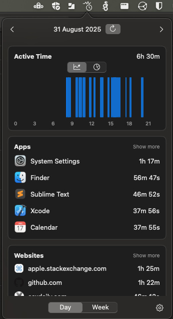
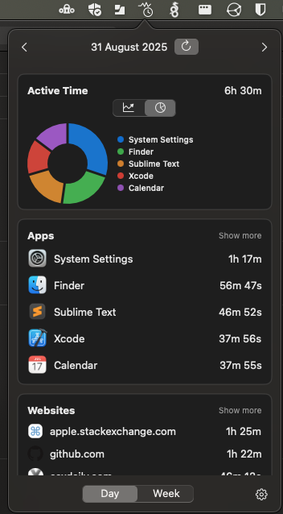
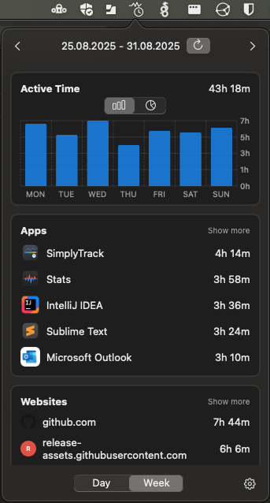

[](LICENSE)
[](https://github.com/renjfk/SimplyTrack/releases/latest)
[](https://github.com/renjfk/SimplyTrack/releases)

<p align="center">
 
</p>

# SimplyTrack

A simple, elegant macOS productivity tracking app that helps you monitor your application and website usage patterns.






## Motivation

I created SimplyTrack out of a personal need to understand and improve my productivity. Like many developers and
professionals, I wanted to track my app and website usage to identify patterns, time-wasters, and productivity trends.

After trying several existing solutions, I found they were either:

- **Too complex** - Loaded with features I didn't need
- **Too limited** - Missing key functionality I required
- **Too expensive** - Overkill for simple usage tracking
- **Privacy concerns** - Sending data to external servers

So I decided to build exactly what I needed: a clean, privacy-focused, local-only productivity tracker that gives you
insights without the bloat.

## ✨ Features

- **📊 App & Website Tracking** - Monitor time spent in applications and websites
- **📈 Visual Analytics** - Charts showing daily/weekly activity patterns
- **🔒 Privacy-First** - All data stored locally, no cloud sync
- **🚀 Menu Bar Interface** - Clean popover UI, native macOS integration
- **⚡ Smart Detection** - Automatic idle detection and session management

## 🛠️ Installation

### Requirements

- macOS 14.0 (Sonoma) or later
- Apple Silicon Mac

### Download

**[⬇️ Download SimplyTrack.dmg](https://github.com/renjfk/SimplyTrack/releases/latest/download/SimplyTrack.dmg)**

Or manually:

1. Go to the [Releases](https://github.com/renjfk/SimplyTrack/releases) page
2. Download the latest `SimplyTrack.dmg` file
3. Open the DMG and drag SimplyTrack to your Applications folder
4. Launch SimplyTrack and follow the permission setup guide

### Building from Source

```bash
git clone https://github.com/renjfk/SimplyTrack.git
cd SimplyTrack
open SimplyTrack.xcodeproj
```

Build and run in Xcode 15.0 or later.

## Setup & Permissions

SimplyTrack requires several macOS permissions to function properly:

### Required Permissions

1. **Automation Permission**: To track browser activity
    - System Preferences → Privacy & Security → Automation
    - Enable SimplyTrack for your browsers

2. **Notifications** (Optional): For update notifications
    - System Preferences → Notifications & Focus → SimplyTrack

### Permission Setup

The app provides helpful banners and direct links to the appropriate system preference panes when permissions are
needed.

## Contributing

SimplyTrack is open to contributions and ideas! Whether you're a developer wanting to add features or a user with
suggestions, your input is valuable.

### Issue Conventions

When creating issues, please follow our simple naming convention:

**Format:** `type: brief description`

#### Issue Types

- `feat:` - New features or functionality
- `fix:` - Bug fixes  
- `enhance:` - Improvements to existing features
- `chore:` - Maintenance tasks, dependencies, cleanup
- `docs:` - Documentation updates
- `build:` - Build system, CI/CD changes

#### Examples

- `feat: add CSV export functionality`
- `fix: app crashes when importing large files`
- `enhance: improve data loading performance`
- `chore: update dependencies to latest versions`
- `docs: update README with installation instructions`
- `build: update Xcode project settings`

#### Guidelines

- Use lowercase for the description
- Be specific and actionable
- Keep under 60 characters
- No period at the end

## TODO

- [ ] **Unit Tests**: Comprehensive test coverage for core functionality
- [ ] **UI Tests**: Automated UI testing for user interactions

## License

This project is licensed under the [MIT License](LICENSE).